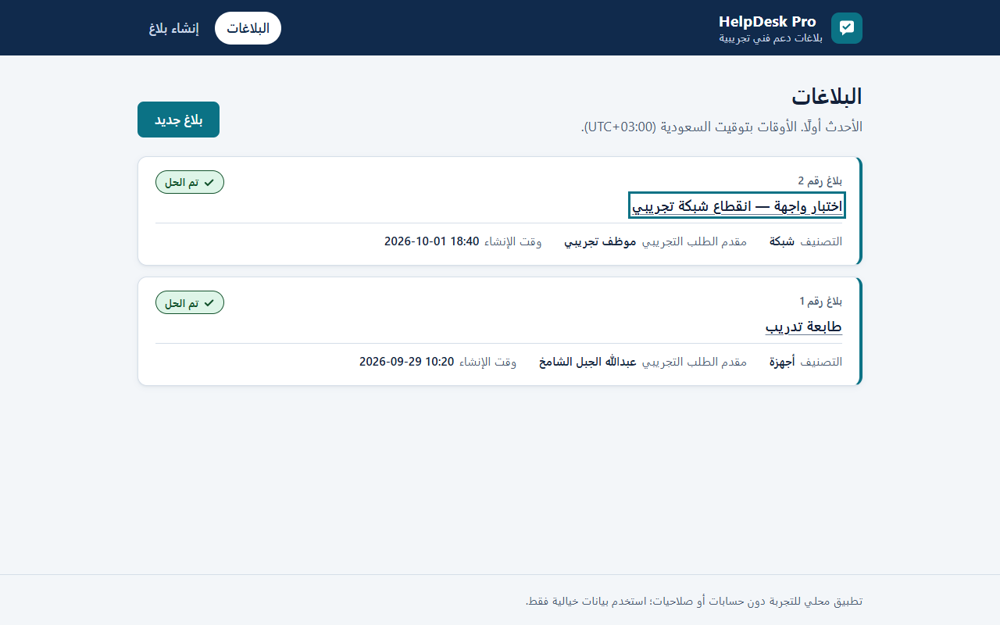
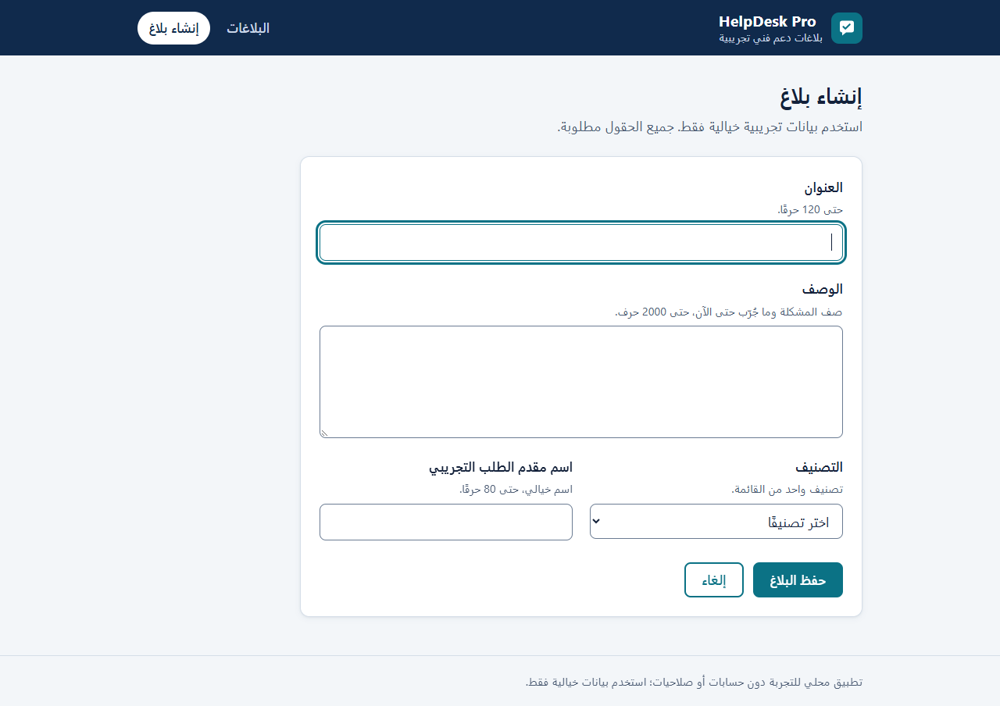
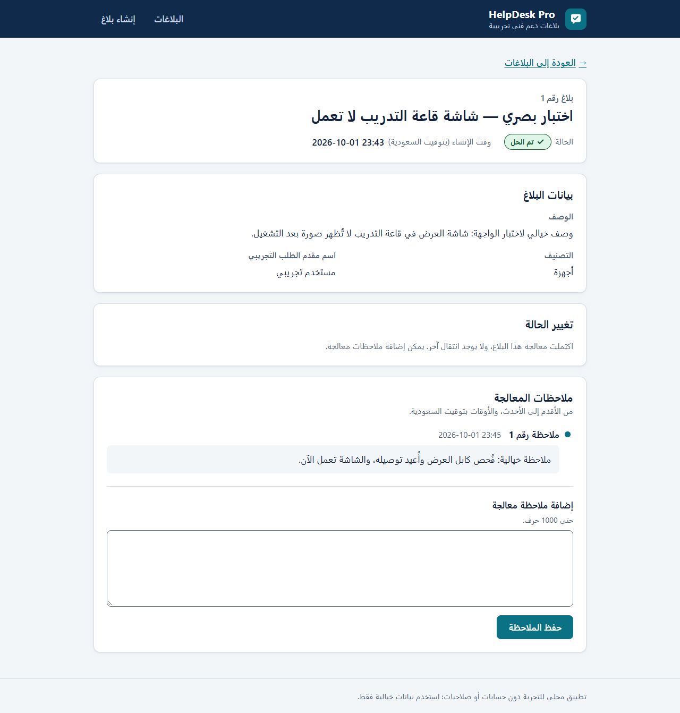

# HelpDesk Pro

تطبيق ويب محلي لتجربة دورة بلاغات الدعم الفني: إنشاء بلاغ، عرضه، متابعة حالته، وتدوين ملاحظات معالجته. يهدف إلى جمع البلاغات التي تصل عبر قنوات متفرقة في قائمة واحدة يمكن الرجوع إليها.

واجهة عربية باتجاه RTL، وبيانات محفوظة في SQLite، وأوقات معروضة بتوقيت السعودية. **الحالة: نتيجة قابلة للمراجعة؛ اكتمل الفحص البصري والإصلاح حسب تقرير Claude، وراجعت ChatGPT صور الصفحات الثلاث المكتبية. الحفظ في Git ورفع GitHub ما زالا معلقين.**

## الميزات المنفذة

- صفحة قائمة البلاغات مع رسالة عند خلوها، وروابط لإنشاء بلاغ وفتح تفاصيله.
- نموذج إنشاء بعنوان ووصف وتصنيف من «أجهزة، برامج، شبكة، أخرى» واسم مقدم طلب تجريبي. يتحقق الخادم من الحقول وحدودها بعد حذف الفراغات الطرفية، ويعرض الأخطاء مع إبقاء القيم عند الفشل.
- حفظ البلاغات في SQLite داخل `instance/helpdesk.sqlite3`. يولّد النظام رقم البلاغ ووقت إنشائه بتوقيت UTC وحالته الابتدائية «جديد».
- صفحة تفاصيل تعرض بيانات البلاغ المحفوظ. يبقى البلاغ ظاهرًا بعد إعادة فتح التطبيق.
- تغيير الحالة خطوة واحدة فقط: «جديد» ← «قيد المعالجة» ← «تم الحل». تعرض التفاصيل زر الانتقال التالي وحده، ويختفي عند الحل. يتحقق الخادم من الانتقال ويحفظ الحالة في SQLite لتظهر في التفاصيل والقائمة بعد إعادة الفتح.
- إضافة ملاحظات معالجة من صفحة التفاصيل في أي حالة، بما فيها «تم الحل». نص الملاحظة مطلوب وبحد أقصى 1000 حرف بعد حذف الفراغات الطرفية؛ عند الخطأ يظهر السبب ويبقى النص المدخل دون حفظ. تُحفظ الملاحظات بأرقام وأوقات إنشاء يولّدها النظام في SQLite، وتُعرض من الأقدم إلى الأحدث.
- واجهة عربية RTL بخطوط الجهاز، بترويسة HelpDesk Pro وتنقل بين «البلاغات» و«إنشاء بلاغ». تُعرض البلاغات بطاقاتٍ مع شارات حالة تجمع النص وأيقونة مختلفة لكل حالة. نموذج الإنشاء يعرض تلميحات الحدود وأخطاء التحقق عند كل حقل، مع ملخص للأخطاء. التفاصيل مرتبة: البلاغ، ثم بياناته، ثم تغيير الحالة، ثم الملاحظات زمنيًا ونموذج الإضافة. الأنماط في `static/style.css`، ومساعدات العرض في `templates/_macros.html`.

## صور الواجهة

لقطات مكتبية ببيانات تجريبية خيالية. قد تختلف البلاغات بين الصور؛ لا تمثل اللقطات بلاغًا واحدًا متصلًا عبر الصفحات.

### قائمة البلاغات



### إنشاء بلاغ



### تفاصيل بلاغ محلول



## التقنيات

| الجزء | التقنية |
| --- | --- |
| الخادم والمسارات والتحقق | Python وFlask 3.1.3 |
| التخزين المحلي | SQLite عبر مكتبة Python القياسية |
| عرض الصفحات | قوالب Jinja2 وHTML عربي |
| التنسيق | CSS محلي في `static/style.css`، دون مكتبات أو خطوط خارجية |
| الاختبارات | `unittest` وعميل اختبار Flask، مع قواعد مؤقتة |

الاعتماديات وإصداراتها مثبتة في [requirements.txt](requirements.txt). بيانات التطبيق محفوظة محليًا في `instance/helpdesk.sqlite3`؛ البيئة الافتراضية وقاعدة البيانات مستثناتان من Git.

## الإعداد والتشغيل

يلزم تثبيت Python. افتح PowerShell داخل مجلد `helpdesk-pro`، ثم نفّذ إعداد البيئة في أول تشغيل:

```powershell
python -m venv .venv
.\.venv\Scripts\python.exe -m pip install -r requirements.txt
```

إذا كانت البيئة والاعتماديات مجهزة، شغّل التطبيق مباشرة:

```powershell
.\.venv\Scripts\python.exe app.py
```

افتح [http://127.0.0.1:5000/](http://127.0.0.1:5000/). يُنشأ مجلد `instance/` وقاعدة البيانات تلقائيًا إذا لم يكونا موجودين، وتُقرأ البيانات الموجودة عند إعادة التشغيل. أوقف الخادم بـ`Ctrl+C` من نافذة تشغيله. يحتفظ الخادم بالقوالب التي حمّلها، فأعد تشغيله بعد تعديل القوالب لرؤية النسخة الجديدة.

## الاختبارات

شغّل المجموعة من مجلد المشروع باستخدام البيئة الموجودة، دون غلاف خارجي:

```powershell
.\.venv\Scripts\python.exe -m unittest -v
```

تستخدم اختبارات التطبيق `TemporaryDirectory` وقاعدة SQLite منفصلة لكل اختبار، وتُحذف القواعد المؤقتة بعده. استيراد `app.py` لا يهيّئ قاعدة التطبيق، ويتأكد اختبار العزل والحارس عند التحميل من عدم فتح أي قاعدة أثناء الاستيراد.

تشمل المجموعة إنشاء البلاغ وحفظه، ورفض الإدخال غير الصحيح، وتسلسل الحالة، وحفظ الملاحظات وترتيبها، والتوقيت السعودي، وعزل الاستيراد. النتيجة المسجلة لإصلاح العزل: **15 اختبارًا ناجحًا**؛ وأفاد Claude بنجاح **15 اختبارًا** بعد تحسين الواجهة وبقاء قاعدة التطبيق دون تغيير. **لم تُعد الاختبارات في جلسة إعداد العرض أو إنهاء التوثيق هذه.** تفاصيل الأوامر والنتائج السابقة محفوظة في السجل التاريخي أدناه؛ اكتمل الفحص البصري والإصلاح حسب تقرير Claude، ووُثقت مراجعة الصور المكتبية في ChatGPT بتاريخ 2026-10-02.

## عرض الوقت

يظهر وقت إنشاء البلاغ في القائمة والتفاصيل ووقت ملاحظات المعالجة **بتوقيت السعودية (UTC+03:00)** بصيغة `YYYY-MM-DD HH:MM` وباتجاه من اليسار إلى اليمين داخل الواجهة العربية. يحوّل فلتر Jinja المشترك `saudi_time` الوقت عند العرض باستخدام `datetime` و`timezone` من مكتبة Python القياسية، دون اعتماديات إضافية. تبقى القيم المخزنة في SQLite وقيم `datetime` الأصلية في عناصر `time` بصيغة UTC الحالية، ولا يتغير ترتيب البلاغات أو الملاحظات.

## الاستخدام وحدود النسخة الأولى

افتح القائمة، وأنشئ بلاغًا بعنوان ووصف وتصنيف واسم مقدم طلب خيالي، ثم افتح تفاصيله لمتابعة حالته وإضافة ملاحظات. يولّد النظام رقم البلاغ وأوقات الإنشاء، ولا يُدخلها المستخدم.

**استخدم بيانات خيالية فقط.** هذه نسخة محلية تجريبية دون حسابات أو صلاحيات، وغير مناسبة لبيانات حقيقية أو للنشر العام بهذه الحالة. الحالة تنتقل بالترتيب «جديد» ← «قيد المعالجة» ← «تم الحل»؛ إعادة فتح البلاغ مؤجلة. لا توجد حاليًا ميزات الإسناد، وتتبع الأجهزة، والمرفقات، والإشعارات، والتقارير، والبحث المتقدم.

تغطية الخادم الموجودة ونجاح الاختبارات لا تعني اكتمال كل معايير القبول اليدوية؛ تُقرأ نتائج التحقق السابقة في سياق جلساتها في السجل التاريخي. اكتمل الفحص البصري والإصلاح حسب تقرير Claude، وأُضيفت الصور المكتبية الثلاث بعد مراجعتها في ChatGPT. وصف الـCV مسودة تنتظر اعتماد النسخة النهائية، والحفظ في Git ورفع GitHub ما زالا معلقين.

## ملفات المشروع

- [PROJECT-PLAN.md](PROJECT-PLAN.md): نطاق النسخة الأولى ومعايير قبولها ومراحل الاختبار.
- [DESIGN.md](DESIGN.md): الصفحات والبيانات والتحقق وسيناريو التجربة اليدوية.
- [OPEN-QUESTIONS.md](OPEN-QUESTIONS.md): قرارات وأسئلة المشروع.

- [app.py](app.py): مصنع التطبيق والمسارات والتحقق وتهيئة قاعدة البيانات.
- [test_app.py](test_app.py): اختبارات التطبيق وعزل الاستيراد.
- `templates/`: قوالب القائمة والإنشاء والتفاصيل ومساعدات العرض.
- [static/style.css](static/style.css): تنسيق الواجهة العربية.

## نقطة التوقف الحالية — 2026-10-02

- **إنهاء التوثيق:** أُضيفت صور قائمة البلاغات وإنشاء بلاغ وتفاصيل بلاغ محلول بمسارات نسبية إلى الملفات الموجودة، مع توضيح أنها بيانات تجريبية وقد تختلف البلاغات بينها.
- **مصدر اكتمال الفحص:** اكتمل الفحص البصري والإصلاح حسب تقرير Claude الذي نقله عبدالله. تمت مراجعة صور الصفحات الثلاث المكتبية في ChatGPT، كما فُتحت الملفات المحلية الثلاث في جلسة التوثيق هذه للتأكد من محتواها. لم تُعد الاختبارات أو تُغيّر الصور أو الكود أو قاعدة البيانات.
- **فحص الحفظ المحلي:** تؤكد قواعد Git تجاهل `.venv/` و`instance/` و`__pycache__/` و`*.pyc`؛ يشمل `instance/` قاعدة التطبيق وملفات SQLite الجانبية. لا توجد قاعدة بيانات أو بيئة افتراضية أو ملفات مؤقتة متتبعة أو مرحّلة. الملفات غير المتتبعة الحالية هي صور العرض وCSS ومساعدات القوالب؛ لا توجد بينها ملفات مؤقتة. لا توجد قاعدة تجاهل عامة لكل امتدادات `*.tmp` و`*.log`، ولذلك يخص هذا التحقق الملفات الموجودة حاليًا.
- **قبل الحفظ في Git:** النتيجة جاهزة لمراجعة التوثيق والفروق؛ الحفظ في Git ورفع GitHub ما زالا معلقين. لم يُنفّذ `git add` أو Commit أو Push. التعديل في هذه الجلسة محصور في هذا الملف و`../PORTFOLIO-TRACKER.md`؛ المتتبّع خارج مستودع المشروع. آخر Commit باقٍ `2a942e65892ddbae7df84c63e2de12bc16fdd721` على `main`.

### سجل إعداد العرض السابق — 2026-10-01

المدخلات التالية تصف جلسة إعداد التشغيل السابقة وما كان معلقًا وقتها؛ حالة اكتمال الفحص والصور المعتمدة للتوثيق محدثة أعلاه.

- **نطاق جلسة إعداد العرض:** إعادة تشغيل الخادم على 5000 والتحقق عبر GET، وترتيب هذا README وتحديث المتتبّع فقط. لم تُعد الاختبارات، ولم تُرسل نماذج أو تُنشأ سجلات.
- **هوية الخادم وإعادة التشغيل:** طوبقت العملية السابقة `10864` مع عنوان الاستماع `127.0.0.1:5000` وأمر `helpdesk-pro\.venv\Scripts\python.exe app.py` ووقت إنشائها وجلسة التشغيل السابقة. أُوقفت تلك الجلسة فقط، وتأكد توقف الاستجابة، ثم أُعيد التشغيل بالأمر الموثق `.\.venv\Scripts\python.exe app.py`. تُرك التطبيق يعمل على [http://127.0.0.1:5000/](http://127.0.0.1:5000/).
- **التحقق الفعلي بعد إعادة التشغيل:** أعادت `/` و`/tickets/new` و`/tickets/1` و`/tickets/2` و`/static/style.css` الرمز **HTTP 200**. ظهرت الترويسة الجديدة وربط CSS وبطاقات القائمة وتصميم نموذج الإنشاء وتفاصيل البلاغ. طابق CSS المستجاب الملف المحلي. هذا تحقق من الاستجابة والقوالب، وليس إتمامًا للفحص البصري الجاري.
- **البيانات السابقة:** ظهرت روابط البلاغين 1 و2 في القائمة واستجابت تفاصيلهما. بقي البلاغ 2 بحالة «تم الحل» وبملاحظة واحدة: «بدأ فحص اتصال الشبكة — ملاحظة تجريبية لاختبار الحفظ.»؛ وقت الإنشاء `2026-10-01 18:40` ووقت الملاحظة `2026-10-01 18:42` بتوقيت السعودية. أظهرت استجابة HTML قيم `datetime` الأصلية `2026-10-01T15:40:36+00:00` و`2026-10-01T15:42:43+00:00`؛ لم تُقرأ السجلات باتصال مباشر بقاعدة البيانات.
- **سلامة قاعدة التطبيق:** تطابقت بصمة SHA-256 قبل إعادة التشغيل وبعد طلبات GET: `D2B06C6581E3D6A6F9C79A45597A5B8CDABE895974005D0CA9EB6DF00CF9BA80`. بقي الحجم `16384` بايت ووقت آخر تعديل `2026-10-01T15:44:56.5349448Z` دون تغيير.
- **الفحص الجاري والمعلّق:** يعمل Claude على فحص بصري إضافي بقاعدة مؤقتة على المنفذ 5001، ويملك `docs/screenshots/`. لم يُستخدم ذلك المنفذ أو تُعدّل ملفاته في هذه الجلسة. تنتظر النتائج واللقطات الاستلام والاعتماد؛ لم تُضف روابط لقطات أو GitHub. رفع GitHub واعتماد العرض ووصف الـCV ما زالت معلقة.
- **حالة Git ومصدرها:** آخر Commit على `main` هو `2a942e65892ddbae7df84c63e2de12bc16fdd721` — `Display timestamps in Saudi time`، بتاريخ 2026-09-30، 18:25:17 بتوقيت السعودية. توجد تعديلات سابقة غير مرحّلة في `app.py` و`test_app.py` والقوالب الأربع، وملفا `static/style.css` و`templates/_macros.html` غير متتبعين؛ أُبقيت دون تعديل. التعديل في هذه الجلسة محصور في `README.md` و`../PORTFOLIO-TRACKER.md` خارج مستودع المشروع. لم يُنشأ Commit أو يُرفع شيء.
- **الخطوة التالية:** استلام نتيجة فحص Claude البصري الإضافي ولقطاته واعتماد النسخة النهائية للعرض، ثم حسم فحص الحقول الفارغة المعلق وفق السجل، وتجهيز رفع GitHub عند طلبه.

## السجل التاريخي

<details>
<summary>سجل التجربة والتحقق والتغييرات السابقة — 2026-09-30 و2026-10-01</summary>

حُفظت المدخلات السابقة أدناه مع نتائجها ومصادرها. عبارات «الحالة الحالية» و«هذه الجلسة» فيها تصف وقت تسجيل كل مدخل؛ الحالة المعتمدة الآن في نقطة التوقف أعلاه. وُثق لاحقًا اكتمال الفحص البصري والإصلاح حسب تقرير Claude ومراجعة الصور المكتبية بتاريخ 2026-10-02.

### تجربة الواجهة والتحقق السابق — 2026-10-01

وُثقت نتائج الواجهة التالية بناءً على إفادة عبدالله في طلب التوثيق عن تجربة Claude in Chrome والتدخل اليدوي ومراجعة الصور. لم تُعد تجربة الواجهة، ولم تُفحص قيم UTC من الكود أو قاعدة البيانات في جلسة توثيقها. أُضيف أدناه تحقق مستقل لإصلاح عزل الاختبارات بتاريخ 2026-10-01، وأُبقي سجل مراجعة 2026-09-30 للحفاظ على التوثيق والتعديلات السابقة.

- **قراءة التطبيق:** قرأ Claude in Chrome صفحة التطبيق باستخدام أداة المتصفح.
- **البلاغ التجريبي رقم 2:** أنشأه Claude بحالة «جديد»، ثم نقله إلى «قيد المعالجة» وأضاف ملاحظة واحدة. نقله عبدالله يدويًا إلى «تم الحل». تؤكد لقطات الشاشة بعد تحديث الصفحات بقاء حالة «تم الحل» في التفاصيل والقائمة، وبقاء الملاحظة دون تكرار، بحسب النتائج المقدمة للتوثيق.
- **عرض الوقت وثباته:** ظهر وقت إنشاء البلاغ `18:40` ووقت الملاحظة `18:42`، وثبتا بعد التحديث. بحسب تقرير Claude، قيم UTC هي `15:40:36` للإنشاء و`15:42:43` للملاحظة، وتوافق العرض السعودي `UTC+03:00` بالدقيقة. راجع ChatGPT الصور، ولم يفحص هذه القيم من الكود بنفسه؛ قيم UTC هنا منسوبة إلى تقرير Claude وليست تحققًا مستقلًا في هذه الجلسة.
- **ملاحظة تفاعل المتصفح:** ذكر Claude أن أول محاولة ضغط آلي لتغيير الحالة لم تستجب، ثم نجحت بالضغط باستخدام الإحداثيات. السبب غير مؤكد؛ لا تُسجل هذه الملاحظة كعطل مؤكد في التطبيق.
- **التحقق المتبقي:** لم تُشغّل الاختبارات الآلية في جلسة تجربة الواجهة السابقة؛ شُغّلت المجموعة كاملة لاحقًا بعد إصلاح العزل كما هو موثق أدناه. اختبار الحقول الفارغة من الواجهة ما زال معلقًا؛ تجربة إنشاء البلاغ وتسلسل حالته والملاحظة وثباتها لا تثبت نجاح رفض الإدخال الفارغ أو اكتمال كل معايير القبول.
- **آخر Commit، من فحص Git:** الفرع `main`، والـCommit `2a942e65892ddbae7df84c63e2de12bc16fdd721` — `Display timestamps in Saudi time`، بتاريخ **2026-09-30، 18:25:17 بتوقيت السعودية**. لم يتغير آخر Commit بهذه الجلسة.
- **حالة Git عند توثيق تجربة الواجهة:** عند بدء تلك المراجعة كان `README.md` وحده معدلًا وغير مرحّل؛ لم توجد تغييرات مرحّلة أو ملفات غير متتبعة. حُفظت التعديلات السابقة، وبعد ذلك التوثيق كان `README.md` وحده معدلًا داخل مستودع `helpdesk-pro` وغير مرحّل. حُدّث `../PORTFOLIO-TRACKER.md` أيضًا، وهو خارج مستودع المشروع؛ المجلد الرئيسي `CV-Projects` ليس مستودع Git. لم يُعدّل كود التطبيق أو قاعدة البيانات في جلسة توثيق تجربة الواجهة، ولم يُنشأ Commit أو يُرفع شيء. حالة جلسة إصلاح العزل أدناه.
- **الحالة الحالية:** يبقى المشروع في «اختبار»، وغير جاهز للـCV أو العرض وفق المتتبّع، إلى حين إتمام التحقق المتبقي ومراجعة نتائجه. تُحفظ القرارات والميزات المؤجلة في سجل المراجعة السابق أدناه.
- **الخطوة التالية:** اختبار رفض إنشاء بلاغ فارغ ورفض حفظ ملاحظة فارغة من الواجهة، وتوثيق النتيجة في موضع التوقف نفسه.

### إصلاح عزل الاختبارات والتحقق — 2026-10-01

- **المشكلة والإصلاح:** كان `app = create_app()` ينفّذ تهيئة قاعدة التطبيق الافتراضية عند استيراد `app.py`، حتى عند تحميل الاختبارات. أُزيل الإنشاء عند الاستيراد، وأصبحت نقطة التشغيل المباشر `if __name__ == "__main__": create_app().run()`. يبقى تشغيل `.\.venv\Scripts\python.exe app.py` مستدعيًا لتهيئة قاعدة البيانات وتشغيل التطبيق؛ لم تتغير المسارات أو القوالب أو مخطط البيانات أو قواعد التحقق.
- **حماية من عودة المشكلة:** أُضيف `ImportIsolationTests.test_import_does_not_open_database` لإعادة تحميل الوحدة مع منع `sqlite3.connect` والتأكد من عدم استدعائه. يوجد الحارس نفسه عند استيراد التطبيق في `test_app.py`، حتى يفشل تحميل الاختبارات قبل فتح أي قاعدة إذا عادت التهيئة عند الاستيراد. الحارس ضمن الاختبارات ولا يغيّر سلوك التطبيق أثناء التشغيل.
- **قواعد الاختبارات:** بقيت اختبارات `TicketTests` تستخدم `TemporaryDirectory` وقاعدة `tickets.sqlite3` منفصلة لكل اختبار، مع تمرير `TESTING=True` و`DATABASE` المؤقتة إلى كل استدعاء لـ`create_app`. تُحذف القواعد المؤقتة بالتنظيف المسجل في الاختبارات. لا يلزم غلاف خارجي أو توجيه قاعدة التطبيق إلى الذاكرة لتشغيل المجموعة.
- **أمر التشغيل والنتيجة الفعلية:** من مجلد المشروع شُغّل `.\.venv\Scripts\python.exe -m unittest -v`. النتيجة: **`Ran 15 tests in 0.645s — OK`**، ورمز خروج `0`؛ نجحت الاختبارات الـ14 السابقة واختبار العزل الجديد. شملت النتيجة اختباري رفض البيانات الفارغة الموجودين، وفحصهما بقاء عدد البلاغات أو الملاحظات صفرًا بعد الرفض. لم تُضف حالات التحقق الناقصة أو ميزات جديدة.
- **دليل سلامة قاعدة التطبيق:** تطابقت بصمة SHA-256 لملف `instance/helpdesk.sqlite3` قبل التشغيل وبعده: `D2B06C6581E3D6A6F9C79A45597A5B8CDABE895974005D0CA9EB6DF00CF9BA80`. بقي الحجم `16384` بايت، ووقت آخر تعديل `2026-10-01T15:44:56.5349448Z` دون تغيير. لم تُفتح قاعدة التطبيق باتصال SQLite في الاختبارات؛ قياس البصمة والبيانات الوصفية قراءة للملف فقط.
- **حالة Git بعد الإصلاح:** على `main` أصبحت `app.py` و`test_app.py` و`README.md` معدلة وغير مرحّلة، مع الحفاظ على تعديل README السابق؛ لا تغييرات مرحّلة أو ملفات غير متتبعة. حُدّث `../PORTFOLIO-TRACKER.md` خارج المستودع. بقي آخر Commit `2a942e65892ddbae7df84c63e2de12bc16fdd721` — `Display timestamps in Saudi time`، ولم يُنشأ Commit أو يُرفع شيء. تبقى الحالة «اختبار» والخطوة التالية تجربة رفض الحقول الفارغة من الواجهة.

### تحسين الواجهة والتحقق — 2026-10-01

- **التغيير:** عُدّلت القوالب الأربع، وأُضيف `static/style.css` و`templates/_macros.html`. بقيت المسارات وأسماء الحقول ومنطق التحقق وانتقال الحالات والتوقيت السعودي دون تغيير، ولم يُعدَّل `app.py` في هذه الجلسة. لم تُضف مكتبات أو خطوط خارجية.
- **التصميم:** خلفية فاتحة ونص كحلي ولون أساسي أزرق مائل للأخضر `#0b7285`. تباين النصوص والأزرار والشارات بين 5.1:1 و16:1 حسابيًا. مؤشر تركيز ظاهر ورابط تخطٍّ إلى المحتوى. تنكسر العناوين والأسماء الطويلة التي لا مسافات فيها إلى أسطر، دون تمرير أفقي.
- **الاختبارات:** شُغّل `.\.venv\Scripts\python.exe -m unittest -v` مرة واحدة بعد تعديل القوالب: **`Ran 15 tests in 0.713s — OK`**، ورمز خروج `0`. عُدّل بعدها `static/style.css` فقط، ولا تفحصه الاختبارات.
- **فحص الصفحات:** شُغّل التطبيق على `127.0.0.1:5001` بالأمر `.\.venv\Scripts\python.exe -m flask --app app run --port 5001`، وطُلبت الصفحات بـGET فقط. أعادت `/` و`/tickets/new` و`/tickets/1` و`/tickets/2` و`/static/style.css` الرمز 200، وأعاد `/tickets/999` الرمز 404. لا يحتوي سجل الخادم أي طلب غير GET.
- **الفحص البصري:** فُحصت القائمة والإنشاء والتفاصيل في المتصفح المدمج بعرض 1280 و375 بكسل، دون إرسال أي نموذج. عند 375 بكسل كان عرض التمرير مساويًا لعرض الصفحة في الصفحات الثلاث، ولم يتجاوز أي عنصر حدودها. اختُبرت نصوص بأقصى طول دون مسافات بتعديل مؤقت داخل المتصفح فقط. ظهر مؤشر التركيز عند التنقل بلوحة المفاتيح.
- **حدود التحقق:** لم تُعرض حالات أخطاء النموذج ولا زر تغيير الحالة بصريًا، لأن ذلك يتطلب POST، والبلاغان الموجودان في حالة «تم الحل». تغطيها الاختبارات الآلية نصيًا فقط. لم يُفحص قارئ شاشة فعلي، ولم يُفحص متصفح غير المتصفح المدمج.
- **سلامة القاعدة:** بقيت بصمة `instance/helpdesk.sqlite3` وحجمها ووقت آخر تعديل كما في القسم السابق قبل الاختبارات وبعد الفحص.
- **ملاحظة تشغيل:** كانت نسخة سابقة من التطبيق تعمل على المنفذ 5000، وتعرض القوالب القديمة المخزنة لديها. لم تُوقف هذه النسخة. لرؤية الواجهة الجديدة أعد تشغيل التطبيق.
- **حالة Git:** القوالب الأربع و`README.md` و`app.py` و`test_app.py` معدلة وغير مرحّلة. التعديلات السابقة محفوظة. الملفان `static/` و`templates/_macros.html` غير متتبعين. لم يُنشأ Commit أو يُرفع شيء.

### سجل المراجعة السابق — 2026-09-30

حُدّث موضع التوقف هنا من ملفات المشروع الفعلية وحالة Git، دون إنشاء سجل تقدم منفصل. مصدر الحالة: `app.py` وقوالب `templates/` و`test_app.py` والتوثيق الحالي، وأوامر `git status` و`git log -1` و`git show HEAD`؛ ليست هذه مراجعة تشغيل للتطبيق.

- **المنفذ:** إنشاء البلاغ والتحقق من حقوله، القائمة والتفاصيل، الانتقال «جديد» ← «قيد المعالجة» ← «تم الحل»، وملاحظات المعالجة في جميع الحالات، مع الحفظ في SQLite. مرحلة الوقت منفذة ومحفوظة: عرض أوقات البلاغات والملاحظات بتوقيت السعودية `UTC+03:00` وصيغة `YYYY-MM-DD HH:MM` واتجاه `ltr`، مع إبقاء التخزين وسمات `datetime` في UTC وترتيب البلاغات والملاحظات كما هو. تفاصيل الوقت في القسم التالي.
- **آخر تغيير محفوظ:** `Display timestamps in Saudi time`؛ شمل `app.py` و`templates/base.html` و`templates/ticket_list.html` و`templates/ticket_detail.html` و`test_app.py` وهذا الملف. آخر Commit على `main`: `2a942e65892ddbae7df84c63e2de12bc16fdd721` بتاريخ **2026-09-30، 18:25:17 بتوقيت السعودية**؛ المصدر سجل Git وفرق آخر Commit.
- **التحقق ونتائجه المتاحة:** يذكر `PROJECT-PLAN.md` وجود اختبارات آلية للدورة الأساسية، ويحتوي `test_app.py` فعليًا 14 اختبارًا، منها `test_saudi_time_crosses_midnight` لعبور منتصف الليل ونهاية السنة واليوم الكبيس، و`test_saudi_time_display_preserves_existing_data_and_order` للعرض واتجاهه وبقاء البيانات والترتيب. هذه أدلة على تغطية مكتوبة؛ لم يُعثر في الملفات التي روجعت على مخرجات تشغيل أو نتيجة نجاح/فشل محفوظة أو نتيجة تجربة يدوية كاملة. لا يُستنتج نجاح التشغيل من وجود الاختبارات. لم تُعد الاختبارات ولم يُشغّل التطبيق في جلسة التوثيق هذه.
- **حالة الملفات في Git:** كانت شجرة العمل نظيفة عند بدء المراجعة، دون تغييرات مرحّلة أو غير مرحّلة أو ملفات غير متتبعة. بعد هذا التحديث يصبح `README.md` وحده معدلًا داخل المستودع، وغير مرحّل وغير محفوظ في Commit. تحديث `../PORTFOLIO-TRACKER.md` خارج مستودع `helpdesk-pro`؛ المجلد الرئيسي `CV-Projects` ليس مستودع Git. توجد محليًا `.venv/` و`__pycache__/` و`instance/helpdesk.sqlite3` وهي مستثناة من Git؛ وجود قاعدة البيانات لا يثبت نجاح سيناريو التجربة. لم يُنشأ Commit أو يُرفع شيء.
- **العوائق وغير المؤكد:** لا يظهر عائق من فحص الملفات وGit يمنع الانتقال إلى تجربة الواجهة، لكن تشغيل التطبيق الآن ونجاح الاختبارات السابقة والتجربة اليدوية غير مثبتة. يبقى المشروع في «اختبار»، وغير جاهز للـCV أو العرض وفق المتتبّع. الإسناد وتتبع الأجهزة والمرفقات والإشعارات والتقارير والبحث المتقدم مؤجلة؛ الحسابات والصلاحيات غير منفذة.
- **القرارات الأخيرة، مصدرها عبدالله في طلب الانتقال:** أعطانا ChatGPT نسخة تعليمات جديدة تشمل دور Claude التنفيذي؛ تطبيقها في إعدادات المشروع غير مؤكد. بحسب عبدالله، Claude Desktop وCowork وClaude in Chrome مجهزة، والمتصفح المفضل Chrome؛ لم يُتحقق من تجهيزها عمليًا هنا. الاستخدام المقترح التالي لـClaude هو تجربة واجهة HelpDesk Pro بعد التأكد من اكتمال مرحلة الوقت وحفظها وتوثيقها؛ فحص هذه الجلسة أكد تنفيذ الوقت وحفظه في آخر Commit. `WORK-ENVIRONMENT.md` مقترح ولم نؤكد إنشاءه سابقًا؛ لم يُعثر عليه في المجلد الرئيسي أو المشروع أثناء هذه المراجعة، ولم يُنشأ الآن.
- **الخطوة الواحدة التالية:** تجربة واجهة HelpDesk Pro بواسطة Claude في Chrome وفق السيناريو اليدوي في [DESIGN.md](DESIGN.md)، مع مراجعة عرض الوقت السعودي في القائمة والتفاصيل والملاحظات وتوثيق النتيجة في موضع التوقف نفسه.

</details>
